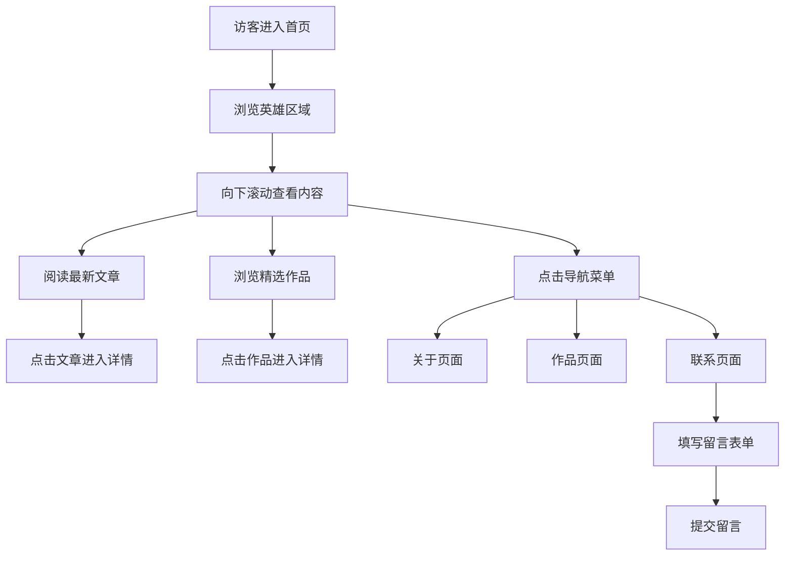

## 1. 产品概述

极简优雅风格的个人博客网站，用于展示个人思想、作品与经历。以阅读体验为核心，通过克制的设计语言营造安静、沉浸的浏览氛围。

- 主要用途：个人品牌展示、文章发布、作品作品集展示、联系方式聚合
- 目标用户：关注内容质量、追求审美品味的读者与潜在合作者
- 产品价值：以极简设计衬托内容本身，建立专业且有温度的个人形象

## 2. 核心功能

### 2.1 功能模块

1. **首页**：英雄区域、最新文章列表、精选作品预览
2. **关于页**：个人简介、经历时间线、技能专长
3. **作品页**：项目作品集网格、项目详情展示
4. **联系页**：联系方式、社交链接、留言表单

### 2.2 页面详情

| 页面名称 | 模块名称 | 功能描述 |
|---------|---------|---------|
| 首页 | 英雄区域 | 大标题个人标语、副标题简介、渐入动画、向下滚动引导 |
| 首页 | 最新文章 | 文章卡片列表、发布日期、分类标签、悬停微动效 |
| 首页 | 精选作品 | 作品预览网格、项目封面、项目名称 |
| 关于页 | 个人简介 | 头像、个人故事、哲学理念 |
| 关于页 | 经历时间线 | 职业/教育经历时间轴、年份标注 |
| 关于页 | 技能专长 | 技能分类展示、熟练度可视化 |
| 作品页 | 作品集网格 | 瀑布流/网格布局、筛选分类、悬停放大效果 |
| 作品页 | 项目详情 | 项目封面、描述、技术栈、链接 |
| 联系页 | 联系信息 | 邮箱、位置、社交媒体图标 |
| 联系页 | 留言表单 | 姓名、邮箱、留言输入框、提交按钮 |

## 3. 核心流程

## 4. 用户界面设计

### 4.1 设计风格

- **设计理念**：少即是多。通过大量留白、精致的排版、微妙的细节，营造安静、优雅、有呼吸感的阅读空间。
- **主色调**：米白色背景（#FAF8F5），温暖不刺眼；深炭灰文字（#2C2C2C），柔和不突兀
- **强调色**：赭石色（#B8743C），温暖沉稳，用于重点文字、链接、按钮
- **辅助色**：浅灰（#E8E4DE）用于分割线、卡片边框；中灰（#8A8680）用于次要文字
- **按钮风格**：极简线框按钮，圆角适中，悬停时背景填充强调色，文字反白
- **字体**：
  - 标题：Playfair Display（衬线字体，优雅经典）
  - 正文：Source Serif 4（易读性强的衬线字体，长文阅读舒适）
  - 辅助文字：Inter（无衬线，简洁现代）
- **布局风格**：居中窄栏内容区，两侧大量留白；顶部简洁导航；卡片式内容模块
- **图标风格**：纤细线性图标，统一描边宽度，极简风格

### 4.2 页面设计概览

| 页面名称 | 模块名称 | UI 元素 |
|---------|---------|---------|
| 首页 | 英雄区域 | 超大衬线标题居中、淡入动画、细分隔线、向下箭头微动效 |
| 首页 | 最新文章 | 左对齐文章列表、日期在上标题在下、悬停时文字右移效果 |
| 首页 | 精选作品 | 两列网格、图片占满卡片、底部渐变遮罩显示标题 |
| 关于页 | 个人简介 | 左侧圆形头像、右侧文字介绍、首字下沉效果 |
| 关于页 | 经历时间线 | 左侧时间轴竖线、圆点标记、右侧内容卡片交替 |
| 关于页 | 技能专长 | 三列网格、图标+标题+描述、进度条动效 |
| 作品页 | 作品集网格 | 响应式网格、分类筛选标签、图片悬停缩放 |
| 联系页 | 联系信息 | 图标+文字左对齐、社交图标横向排列 |
| 联系页 | 留言表单 | 极简下划线式输入框、左侧标签、右侧输入 |

### 4.3 响应式设计

- **设计策略**：桌面优先，移动端自适应
- **断点设置**：
  - 桌面端：≥ 1200px，最大内容宽度 960px
  - 平板端：768px - 1199px，内容宽度自适应
  - 移动端：< 768px，单列布局，汉堡菜单
- **移动端优化**：触控区域 ≥ 44px，字体大小适中，简化动效

### 4.4 动效与交互

- **页面加载**：标题先淡入，然后内容依次渐入，错落有致
- **滚动效果**：导航栏滚动时添加细微阴影；元素进入视口时淡入上移
- **悬停效果**：链接下划线从左往右展开；图片轻微放大；卡片微抬升
- **点击反馈**：按钮点击时轻微缩放，波纹效果
