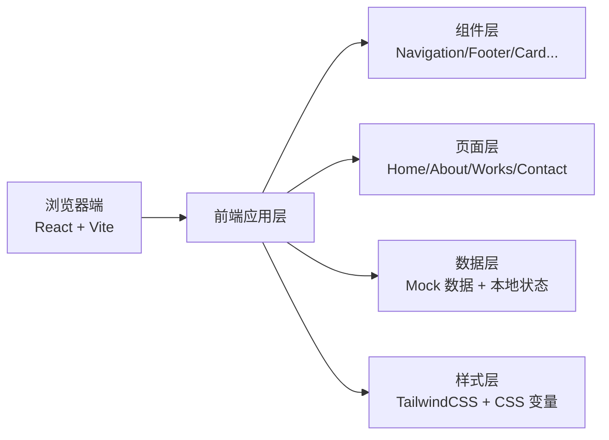

## 1. 架构设计



## 2. 技术说明

- **前端框架**：React@18 + TypeScript
- **构建工具**：Vite@5
- **样式方案**：TailwindCSS@3 + CSS 变量（主题系统）
- **路由方案**：React Router DOM@6
- **图标库**：Lucide React（极简线性图标）
- **动画方案**：CSS Transitions + Framer Motion（滚动动效）
- **后端**：无（纯静态网站，数据使用 Mock）
- **部署**：静态文件部署，支持 Vercel / Netlify / GitHub Pages

## 3. 目录结构

```
src/
├── components/          # 可复用组件
│   ├── Navbar.tsx       # 导航栏
│   ├── Footer.tsx       # 页脚
│   ├── ArticleCard.tsx  # 文章卡片
│   ├── ProjectCard.tsx  # 项目卡片
│   ├── Timeline.tsx     # 时间线组件
│   └── SkillBar.tsx     # 技能进度条
├── pages/               # 页面组件
│   ├── Home.tsx         # 首页
│   ├── About.tsx        # 关于页
│   ├── Works.tsx        # 作品页
│   └── Contact.tsx      # 联系页
├── data/                # Mock 数据
│   ├── articles.ts      # 文章数据
│   ├── projects.ts      # 项目数据
│   ├── experience.ts    # 经历数据
│   └── skills.ts        # 技能数据
├── hooks/               # 自定义 Hooks
│   └── useScrollReveal.ts  # 滚动显示动效
├── styles/              # 全局样式
│   └── globals.css      # 全局样式 + Tailwind
├── App.tsx              # 应用入口
├── main.tsx             # React 入口
└── vite-env.d.ts        # 类型声明
```

## 4. 路由定义

| 路由路径 | 页面名称 | 说明 |
|---------|---------|------|
| `/` | 首页 | 英雄区域、最新文章、精选作品 |
| `/about` | 关于页 | 个人简介、经历时间线、技能专长 |
| `/works` | 作品页 | 作品集网格、项目详情 |
| `/contact` | 联系页 | 联系方式、留言表单 |

## 5. 数据模型

### 5.1 文章数据类型

```typescript
interface Article {
  id: string;
  title: string;
  excerpt: string;
  date: string;
  category: string;
  coverImage?: string;
  readTime: string;
}
```

### 5.2 项目数据类型

```typescript
interface Project {
  id: string;
  title: string;
  description: string;
  coverImage: string;
  category: string;
  techStack: string[];
  link?: string;
  year: string;
}
```

### 5.3 经历数据类型

```typescript
interface Experience {
  id: string;
  year: string;
  title: string;
  organization: string;
  description: string;
  type: 'work' | 'education';
}
```

### 5.4 技能数据类型

```typescript
interface Skill {
  id: string;
  name: string;
  level: number; // 0-100
  category: string;
}
```

## 6. 性能与优化

- **代码分割**：基于路由的懒加载
- **图片优化**：使用现代图片格式，懒加载
- **字体优化**：字体预加载，使用 `font-display: swap`
- **CSS 优化**：Tailwind JIT 模式，按需生成样式
- **动画性能**：优先使用 transform 和 opacity 属性动画
